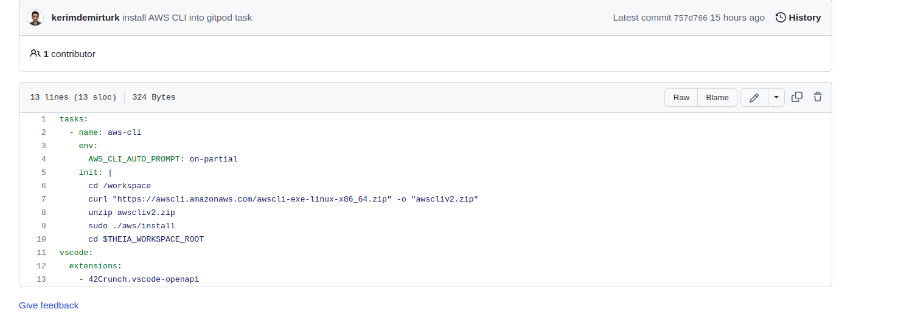
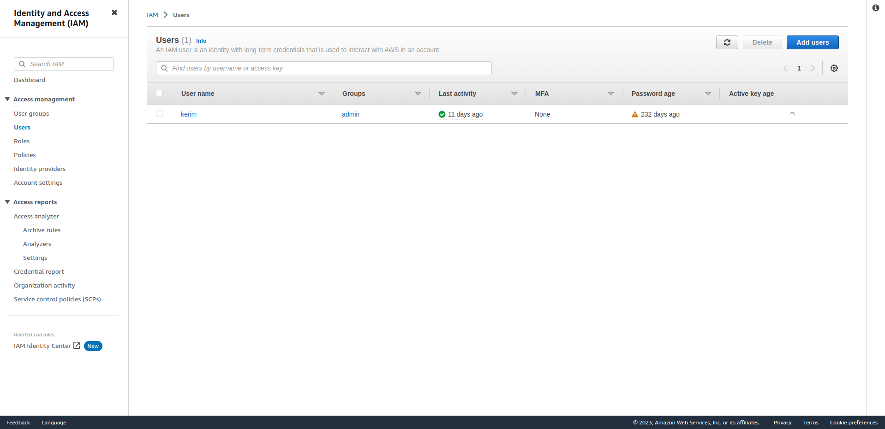
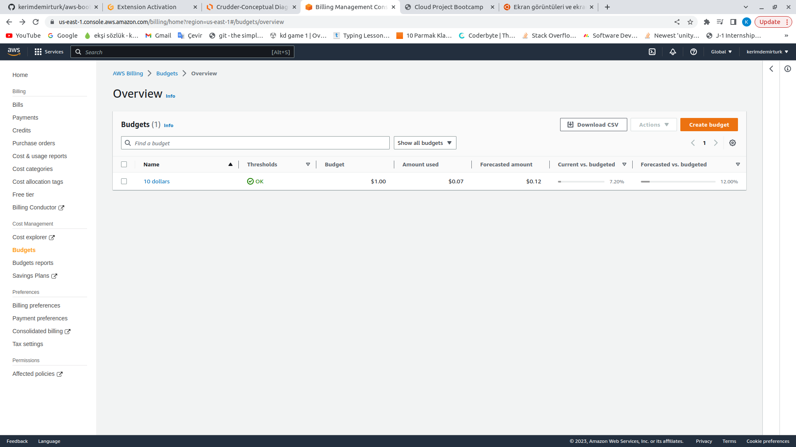
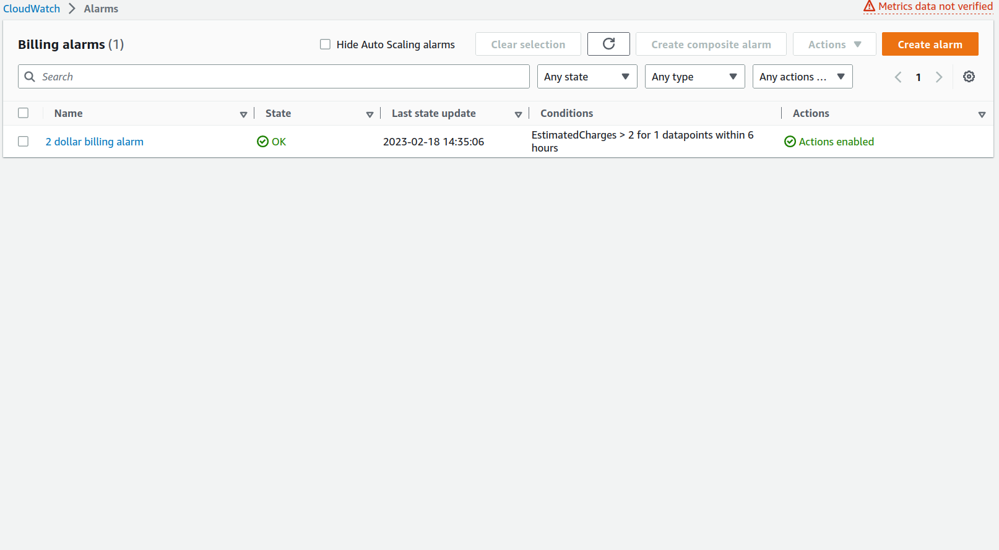
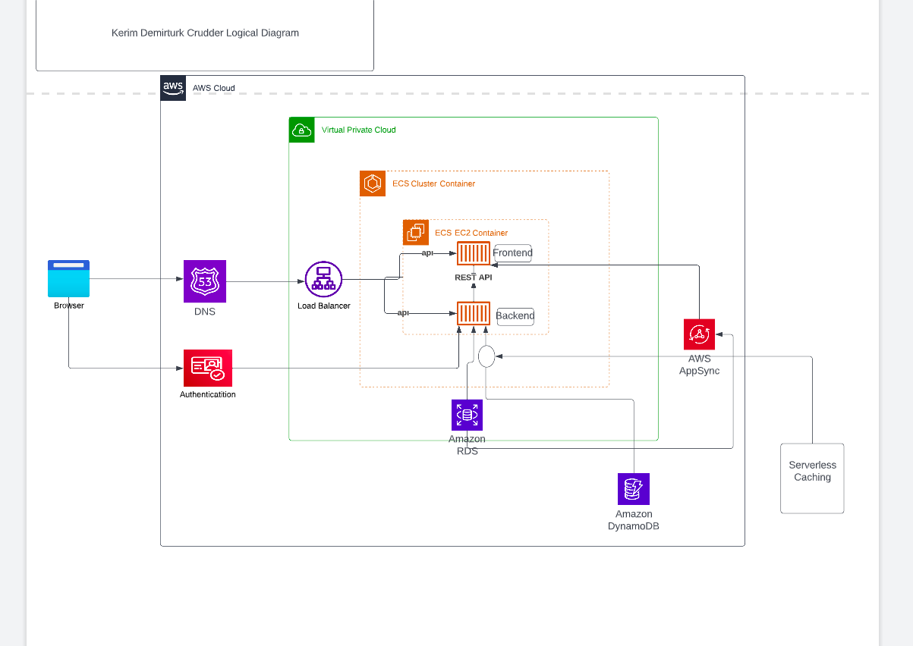

# Week 0 — Billing and Architecture

#Required homework/Tasks

#Install and Verify AWS ClI 
I watch your youtube video and ınstall AWS CLI and when ı open to gitpod evertime its ready to use you can see in gitpod.yml files.

 
After I create ıam user

 
Then I create budget.Actually I created this when I first enter to aws

 
Then create billing alarm for 2 dollar limit

 
Finally create logical diagram for crudderAPP

