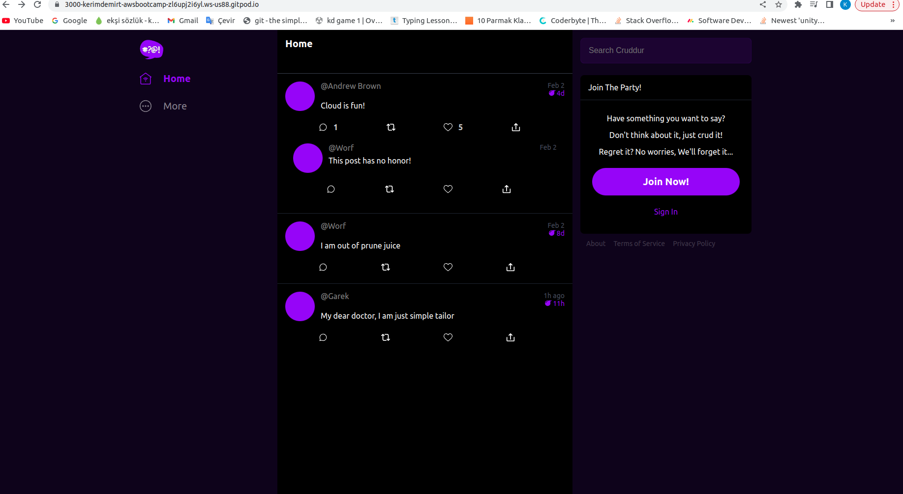

# Week 1 — App Containerization

#Homeworks 
I started to do my homework from watch the stream videos and contanarized my applications both for backend and frontend also add docker compose.Than add notifications features for frontend and backend.Then start to learn docker from other source because its realy confusing for me and need to work extra.You can see all change in commits.I also add pictures for showing my homeworks to you.

